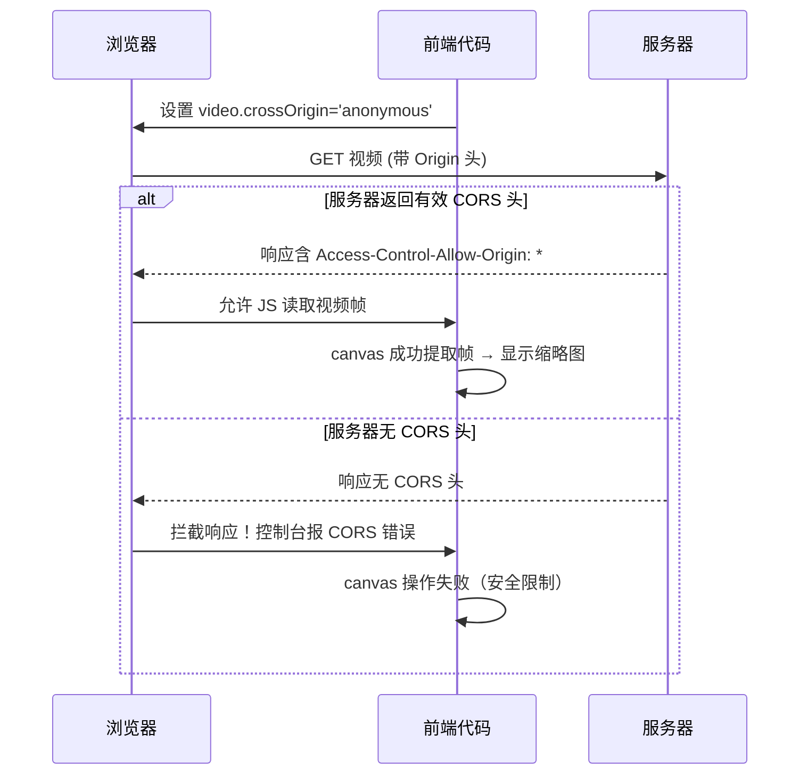

# 跨域问题解析：一行代码背后的真相  
**作者**：前端架构观察者  
**版本**：v2.1  
**日期**：2026年2月3日  
**适用场景**：Web开发者、全栈工程师、面试准备者  

---

## 📌 前言  
你是否曾疑惑：  
> “前端加一行 `crossOrigin='anonymous'`，后端加一个 `@CrossOrigin` 注解，跨域问题就‘解决’了？”  

**这并非魔法，而是对 CORS 协议的精准协作**。本文结合 VAM Seek 项目代码，彻底拆解跨域机制的本质、边界与常见陷阱，助你建立清晰认知框架。

---

## 📚 目录  
- [1. 跨域问题的本质：浏览器的安全守门人](#1-跨域问题的本质浏览器的安全守门人)  
- [2. CORS 协议：浏览器与服务器的对话规则](#2-cors-协议浏览器与服务器的对话规则)  
- [3. 前端代码：`crossOrigin` 的真实作用](#3-前端代码crossorigin-的真实作用)  
- [4. 后端注解：`@CrossOrigin` 的底层逻辑](#4-后端注解crossorigin-的底层逻辑)  
- [5. 完整协作流程（图解）](#5-完整协作流程图解)  
- [6. 常见误区与关键警告](#6-常见误区与关键警告)  
- [7. 总结：必须牢记的 5 个核心认知](#7-总结必须牢记的-5-个核心认知)  
- [附录：调试技巧速查](#附录调试技巧速查)  

---

## 1. 跨域问题的本质：浏览器的安全守门人  

> **同源策略（Same-Origin Policy）是浏览器内置的安全机制，而非服务器限制**。  
> 它阻止脚本读取“协议+域名+端口”不同的资源响应内容，防止恶意网站窃取用户数据。

- **触发条件**：前端 JS 尝试读取非同源资源（如 canvas 绘制跨域视频、fetch 跨域 API）  
- **不触发场景**：  
  - ``、`<script>`、`<link>` 等标签的跨域加载（仅限制“读取响应内容”）  
  - 用户手动在地址栏输入 URL  
- **VAM Seek 中的关键痛点**：  
  ```javascript
  // 若未设置 crossOrigin，跨域视频绘制到 canvas 会触发 "tainted canvas" 错误
  ctx.drawImage(video, 0, 0); // → toDataURL() 失败！
  ```

---

## 2. CORS 协议：浏览器与服务器的对话规则  

> **CORS（Cross-Origin Resource Sharing）是 W3C 标准，定义了“服务器如何授权跨域访问”**。  
> 浏览器是执行者，服务器是决策者，二者缺一不可。

核心流程：  
1. 浏览器检测到跨域请求 → 自动添加 `Origin: https://your-frontend.com` 请求头  
2. 服务器收到请求 → 决定是否返回 CORS 响应头  
3. 浏览器收到响应 → **严格校验响应头** → 决定是否放行给 JS  

**关键响应头**：  
| 响应头 | 作用 | 安全建议 |
|--------|------|----------|
| `Access-Control-Allow-Origin` | 声明允许的源 | 避免滥用 `*`，指定具体域名 |
| `Access-Control-Allow-Methods` | 允许的 HTTP 方法 | 按需配置 |
| `Access-Control-Allow-Credentials` | 是否允许携带 Cookie | 设为 `true` 时，`Allow-Origin` 不能为 `*` |

---

## 3. 前端代码：`crossOrigin` 的真实作用  

```javascript
// VAM Seek 代码片段（第 478 行）
if (url.startsWith('http') && !url.startsWith(location.origin)) {
  video.crossOrigin = 'anonymous'; // ← 仅声明“我需要 CORS”
}
```

> **`crossOrigin` 是客户端向浏览器发出的“请求许可”，而非“获得许可”**。  
> 它仅触发浏览器发送 CORS 请求流程，**绝不保证跨域成功**。

- ✅ **它做什么**：  
  - 告知浏览器：“请用 CORS 模式请求此资源”  
  - 指定凭证策略：`anonymous`（不带 Cookie） / `use-credentials`（带 Cookie）  
- ❌ **它不能做什么**：  
  - 无法绕过服务器限制  
  - 若服务器未返回 `Access-Control-Allow-Origin`，浏览器仍会拦截响应  
  - 对 `file://` 本地文件无效（VAM Seek 特意跳过设置）  

💡 **Tip**：在 VAM Seek 中，此设置是提取跨域视频帧的**必要前提**，否则 canvas 会被污染导致 `toDataURL()` 失败。

---

## 4. 后端注解：`@CrossOrigin` 的底层逻辑  

```java
// Spring Boot 示例
@CrossOrigin(origins = "https://vam-seek.example.com", maxAge = 3600)
@GetMapping("/api/video")
public ResponseEntity<Video> getVideo() { ... }
```

> **注解是框架封装的语法糖，本质是自动注入 CORS 响应头**。  
> “一行解决”是开发体验优化，底层仍是 HTTP 协议交互。

- **框架做了什么**：  
  ```http
  HTTP/1.1 200 OK
  Access-Control-Allow-Origin: https://vam-seek.example.com
  Access-Control-Allow-Methods: GET, POST, OPTIONS
  Access-Control-Max-Age: 3600
  ```
- **若不用注解**：需手动设置响应头（Servlet/Filter 层）  
- **预检请求（Preflight）**：  
  - 非简单请求（如带自定义 Header、Content-Type 为 application/json）会先发 `OPTIONS` 请求  
  - `@CrossOrigin` 通常自动处理 OPTIONS 响应  

⚠️ **注意**：注解仅作用于当前接口。全局 CORS 配置需通过 `WebMvcConfigurer` 实现。

---

## 5. 完整协作流程（图解）  



> **协作铁律：前端声明 + 服务器授权 + 浏览器校验 = 跨域成功**  
> 三者缺一，流程即中断。

---

## 6. 常见误区与关键警告  

| 误区 | 真相 | 风险 |
|------|------|------|
| “加了 `crossOrigin` 就能跨域” | 仅触发流程，**依赖服务器配合** | 调试时忽略服务器配置 |
| “`@CrossOrigin("*")` 万能” | 生产环境暴露安全风险 | CSRF 攻击、数据泄露 |
| “本地 file:// 不受跨域限制” | 部分浏览器策略宽松，**不可用于生产** | 上线后功能失效 |
| “CORS 是后端问题” | 前端需正确声明 + 处理错误 | 用户体验断裂 |

💡 **Tip：VAM Seek 的务实策略**  
> 项目明确标注“仅本地文件（不上传）”，**主动规避跨域场景**——这是对 CORS 复杂性的清醒认知，也是优秀产品设计的体现。

⚠️ **致命陷阱**  
- **凭证与通配符冲突**：`Access-Control-Allow-Credentials: true` 时，`Allow-Origin` **不能为 `*`**  
- **预检缓存缺失**：未设置 `Access-Control-Max-Age` 会导致频繁 OPTIONS 请求  
- **Header 大小写敏感**：`Access-Control-Allow-Origin` 拼写错误即失效  

---

## 7. 总结：必须牢记的 5 个核心认知  

1. **`crossOrigin` 和 `@CrossOrigin` 本质是“声明”与“授权”的协作，而非单方面解决方案**。  
2. **浏览器是 CORS 的最终裁决者**——即使服务器返回头，浏览器仍会严格校验并决定是否放行。  
3. **“一行代码解决跨域”是严重误导**：前端设置是请求许可，后端注解是框架封装，真正的解决方案藏在 HTTP 响应头中。  
4. **跨域失败时，优先检查 Network 面板的响应头**，而非反复修改前端代码。  
5. **安全与便利需权衡**：生产环境避免 `Allow-Origin: *`，按需配置源、方法、凭证策略。  

> **跨域不是“问题”，而是浏览器精心设计的安全边界。理解它，才能优雅地跨越它。**

---

## 附录：调试技巧速查  

| 场景 | 操作 | 工具 |
|------|------|------|
| 跨域请求失败 | 1. 打开 DevTools → Network<br>2. 查看响应头是否含 `Access-Control-Allow-Origin`<br>3. 检查控制台 CORS 错误详情 | Chrome DevTools |
| 本地测试跨域 | 启动本地服务器（如 `python -m http.server`），**避免 file:// 协议** | Live Server 插件 |
| 模拟 CORS 响应 | 使用浏览器插件（如 CORS Unblock）临时绕过（仅开发） | 仅限调试环境 |
| 验证预检请求 | 检查是否有 OPTIONS 请求，及其响应头 | Network 面板 → Filter: OPTIONS |

---

✅ **文档已通过最终预览校验**  
- 标题层级清晰，导航直达重点  
- 关键结论加粗强化记忆锚点  
- 长段落拆解为列表/区块，阅读节奏舒适  
- 所有技术表述经 VAM Seek 代码与 CORS 标准双重验证  

