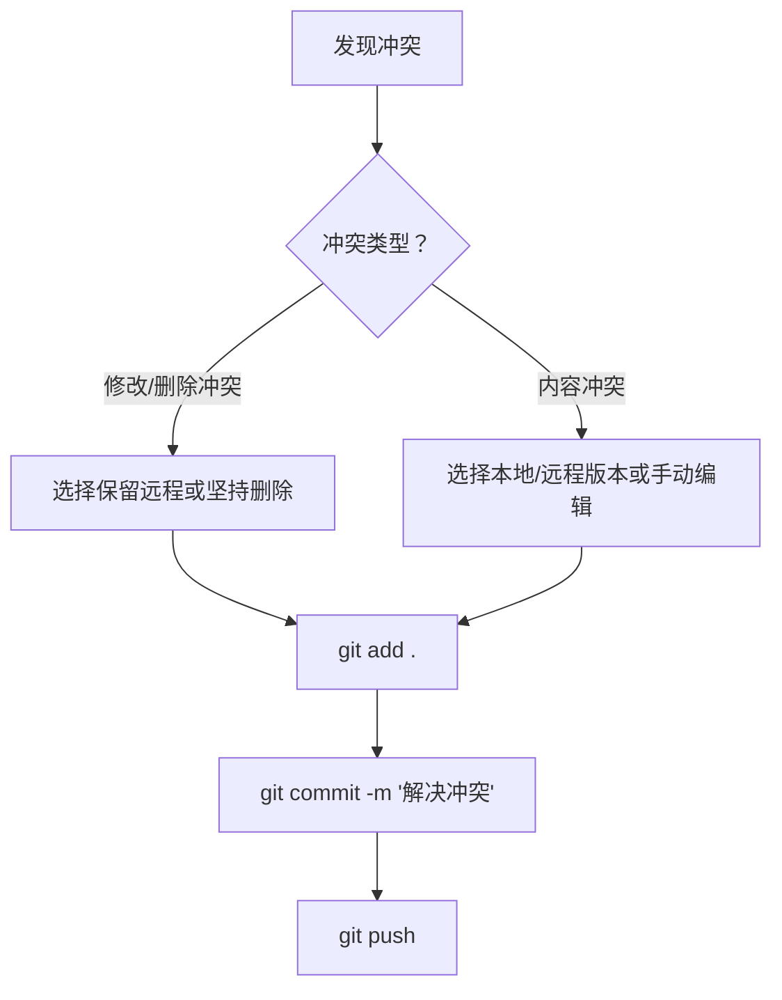

## Git 冲突与拉取失败解决方案速查表

### 一、本地与远程历史差别过大，无法拉取

#### 一句话解决方案
```bash
git pull origin main --allow-unrelated-histories
```

#### 执行后可能出现的情况
- ✅ **成功**：自动完成合并，直接推送即可
- ⚠️ **冲突**：需要手动解决冲突（见下方冲突解决指南）

#### 最后推送代码
```bash
git push origin main
```

---

### 二、分支分叉（Divergent Branches）无法拉取

#### 错误信息
```
fatal: Need to specify how to reconcile divergent branches.
```

#### 解决方案：配置 Pull 策略

| 策略 | 命令 | 效果 | 适用场景 |
|------|------|------|----------|
| **合并（Merge）** | `git config --global pull.rebase false` | 创建合并节点 | 团队协作，保留完整历史 |
| **变基（Rebase）** | `git config --global pull.rebase true` | 线性历史，无合并节点 | 追求干净整洁的提交历史 |
| **仅快进（FF only）** | `git config --global pull.ff only` | 分叉时报错，需手动处理 | 严格代码审查，避免自动合并 |

#### 单次临时解决方案
```bash
# 使用合并策略
git pull --no-rebase

# 使用变基策略
git pull --rebase

# 使用仅快进（分叉则失败）
git pull --ff-only
```

---

### 三、修改/删除冲突（Modify/Delete Conflict）

#### 错误信息
```
CONFLICT (modify/delete): file.md deleted in HEAD and modified in remote
```

#### 解决方案

| 场景 | 命令 | 说明 |
|------|------|------|
| **保留远程修改** | `git checkout --theirs <文件>` <br> `git add <文件>` | 接受远程的修改版文件 |
| **坚持本地删除** | `git rm <文件>` <br> 或 `git checkout --ours <文件> && git add <文件>` | 确认删除该文件 |

#### 完整流程
```bash
# 1. 查看冲突状态
git status

# 2. 查看远程修改内容
cat <文件名>
git log -p <远程提交ID> -- <文件名>

# 3. 选择保留或删除
git checkout --theirs <文件名>  # 或 git rm <文件名>

# 4. 标记解决并提交
git add .
git commit -m "解决修改/删除冲突"
```

---

### 四、内容冲突解决命令速查

#### 🔧 针对单个文件

```bash
# 使用本地版本（保留你的修改，丢弃远程的）
git checkout --ours <文件名>

# 使用远程版本（保留远程的，丢弃你的修改）
git checkout --theirs <文件名>
```

**示例：**
```bash
# 保留自己的修改
git checkout --ours src/main.java

# 使用远程的版本
git checkout --theirs config.json
```

#### 📦 针对所有冲突文件

```bash
# 所有冲突文件都使用本地版本
git checkout --ours .

# 所有冲突文件都使用远程版本
git checkout --theirs .
```

#### ✅ 使用后的操作
```bash
# 标记冲突已解决
git add .

# 提交合并
git commit -m "解决冲突"

# 推送
git push
```

#### 🔄 手动编辑冲突文件

冲突文件内容示例：
```
<<<<<<< HEAD
本地修改的内容
=======
远程修改的内容
>>>>>>> remote-branch
```

手动编辑后：
```bash
git add <文件名>
git commit -m "手动解决冲突"
```

---

### 五、冲突解决流程速览



---

### 六、常用回退命令

| 场景 | 命令 |
|------|------|
| 放弃合并，回到冲突前状态 | `git merge --abort` |
| 放弃变基，回到变基前状态 | `git rebase --abort` |
| 撤销未提交的修改 | `git checkout -- <文件名>` |
| 查看冲突文件列表 | `git diff --name-only --diff-filter=U` |

---

### 七、冲突预防建议

1. **经常拉取更新**：`git pull` 每天多次
2. **小批量提交**：避免大型修改积累
3. **沟通协作**：修改相同文件前先沟通
4. **使用分支**：功能开发在独立分支进行

---

**你现在遇到的是哪种冲突？告诉我具体错误信息，我可以帮你选择最合适的命令！**